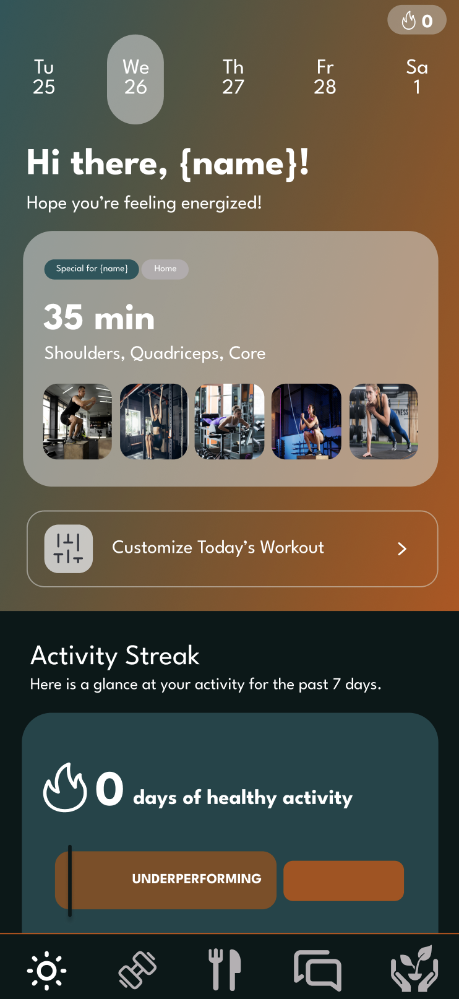

# 🏋️‍♀️ AiRise – Your Smart Personal Health Companion

> An AI-powered fitness and wellness platform designed to provide personalized coaching, real-time progress tracking, smart nutrition advice, and gamified motivation.

 

---

## 📱 Overview

Our AI Fitness App bridges the gap between convenience and results. Built with full-stack flexibility and mobile optimization in mind, it empowers users to take control of their health with personalized routines, meal planning, progress tracking, and smart-device integrations—all driven by AI.

### ✨ Key Features

- **AI-Powered Coaching**  
  Personalized workouts, meal plans, and goal tracking.
- **Smart Progress Tracker**  
  Visual analytics and adaptive goal scaling.
- **Meal Planner & Nutrition Tracker**  
  Daily intake tracking and meal suggestions.
- **Gamification & Social Engagement**  
  Leaderboards, streaks, and community challenges.
- **Smart Device Integration**  
  Connect with fitness trackers and health apps.
- **Push & Email Notifications**  
  Stay on track with timely alerts and weekly summaries.

---

## 📂 Project Structure

This monorepo is structured into two main directories:

```
/frontend   # Android (Kotlin) mobile application
/backend    # RESTful backend API .NET9 
```

Each folder contains its own README with setup details and architecture.

---

## 🚀 Getting Started

### ✅ Prerequisites

- .NET 9 SDK
- Android Studio
- Kotlin Multiplatform

### ⚙️ Environment Setup

Clone the repository and install dependencies for both ends:

```bash
git clone https://github.com/JSDWRLD/AiRise
cd airise
```

#### Frontend (Mobile App)

```bash
cd frontend
# Open in Android Studio
```

#### Backend (API)

```bash
cd backend
# Open in Visual Studio
```

---

## 📸 Visuals

| Feature | Screenshot |
|--------|------------|
| Onboarding UI |  |
| Homescreen |  |
| AI Coach Chat |  |
| Workouts |  |

---

## 🧠 Architecture

  
_An overview of the system: mobile frontend ↔ backend services ↔ database & third-party APIs_

---

## 🛠️ Technologies

| Frontend  | Backend       | AI & ML      | Database     | Integrations        |
|-----------|---------------|--------------|--------------|---------------------|
| Kotlin    | .NET Framework | Google Gemini | MongoDB      | Google Fit, Apple Health |
| KMP   | Firebase Auth | Image Processor | SupaBase | Wearable Devices   |

---

## 📌 Rules & Guidelines

### 🔀 Branching Strategy

- Always use feature branches: `git checkout -b feature/my-feature`
- Never push directly to `main`

### ✅ Pull Request Protocol

- At least **2 reviewers** must approve before merging.
- Ping the team on Discord (`@everyone`) for visibility.
- Keep PRs **small, atomic, and focused**.

### ✍️ Commit Format

```bash
type: short description
```

> Example: `feat: add AI meal suggestion endpoint`

### 🔐 Security

- Do **not** commit `.env` files or secrets.
- Use `.gitignore` to protect sensitive data.

---

## 🧪 Feature Checklist

### ✅ Core Features

- [x] AI-powered workout suggestions
- [x] Nutrition and meal tracking
- [x] Progress analytics
- [x] Community and gamification
- [x] Smart device integration

### 🚧 Stretch Goals

- [ ] 📷 **Computer Vision** for form checking
- [ ] 🥗 Meal image analysis for macronutrient estimation

---

## 🤝 Contributing

Please read the [CONTRIBUTING.md](CONTRIBUTING.md) for guidelines.

---

## 🙌 Credits

Made with ❤️ by 404 Not Found at **[California State University Sacramento]**.  
Special thanks to our mentors, professors, and testers who supported development.

---

> _"The only bad workout is the one that didn’t happen."_  
> — Random Dude
