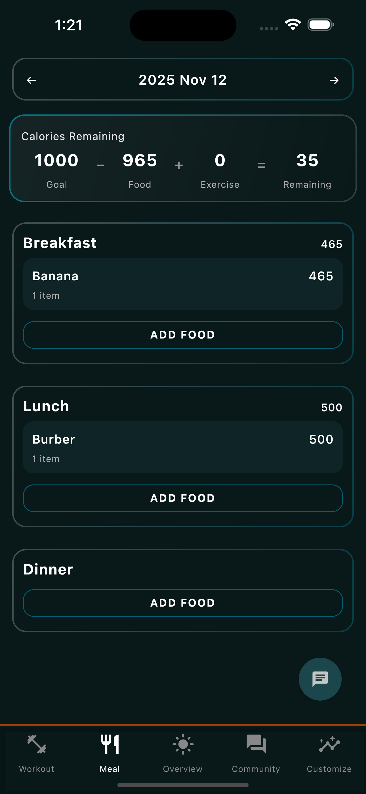
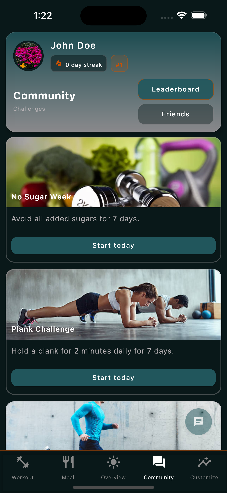
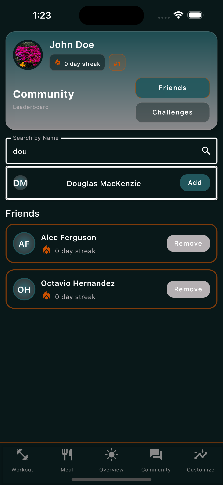
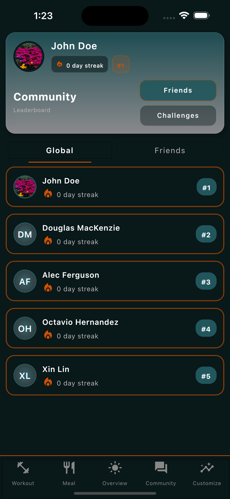
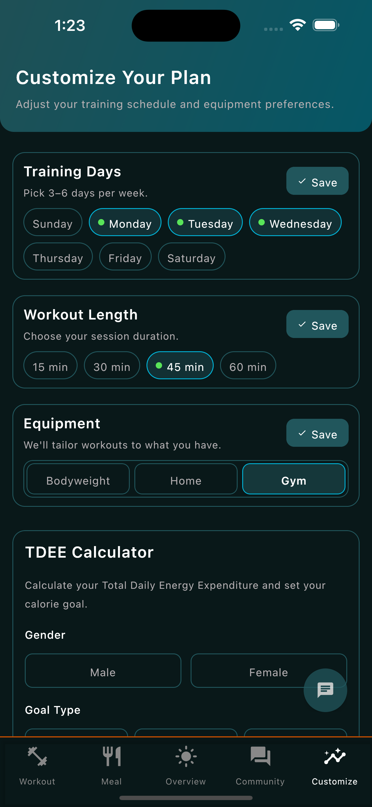
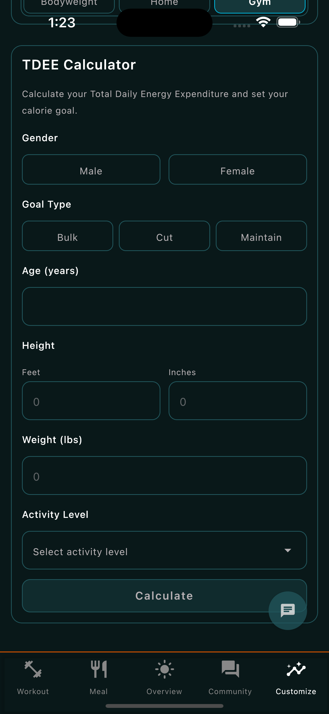
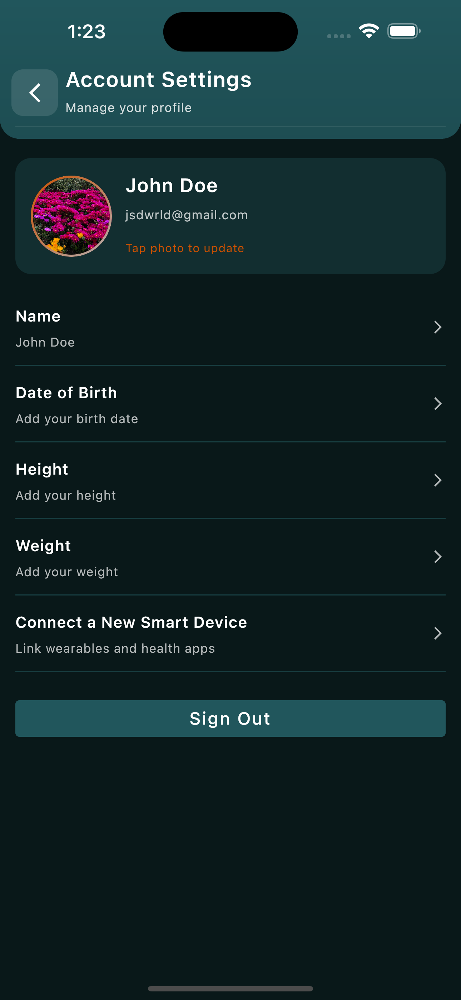
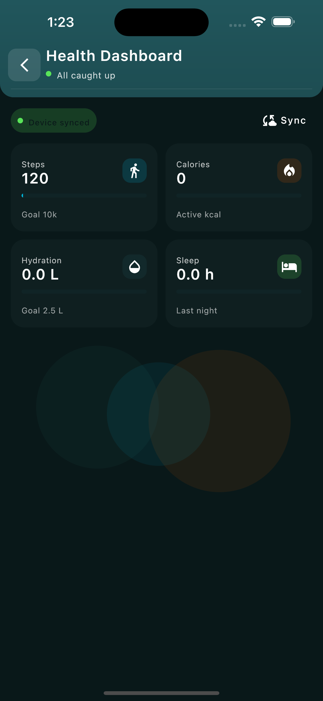
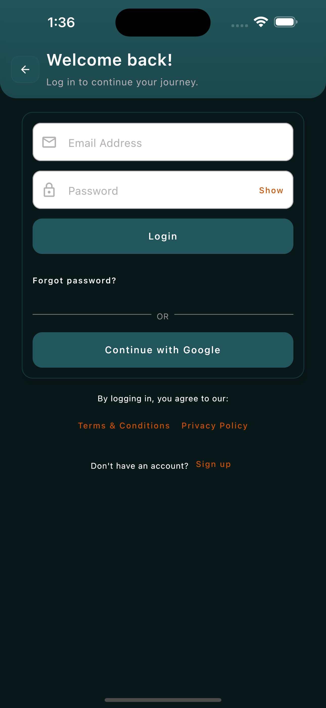
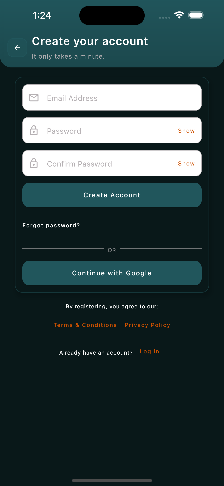

<h1 align="center">🏋️‍♀️ AiRise – The Smart Personal Health Companion</h1>

<p align="center">
  <i>Your all-in-one AI-powered fitness and wellness app — personalized workouts, smart nutrition, community challenges, and adaptive goal tracking.</i>
</p>

<p align="center">
  
</p>

---

## 📖 About AiRise

**AiRise** is a next-generation fitness and wellness platform built to help you achieve your goals — smarter.  
Combining artificial intelligence with your real-world health data, AiRise personalizes your training, nutrition, and motivation to deliver a truly connected fitness experience.

### 💡 Our Mission
To make personal training, nutrition tracking, and health optimization **accessible, intelligent, and motivating** — powered by data, enhanced by AI, and supported by community.

---

## ✨ Core Features

- 🤖 **AI-Powered Coaching** – Chat with your virtual coach for personalized workout & nutrition guidance.  
- 🏠 **Smart Home Dashboard** – Track calories, workouts, sleep, and daily health stats in real time.  
- 💪 **Workout Hub** – Access AI-recommended exercises and see progress across your fitness journey.  
- 🍽️ **Food Logger & Nutrition** – Log meals, track macros, and get intelligent suggestions.  
- 👥 **Community & Challenges** – Join challenges, connect with friends, and climb leaderboards.  
- ⚙️ **Customize Workouts** – Build routines to match your goals and calculate your TDEE.  
- 🧠 **Health Dashboard** – Integrate Apple Health / Google Fit for accurate, synced data.  
- 🔔 **Reminders & Insights** – Stay consistent with notifications and weekly progress summaries.

---

## 🖼️ App Screens & Experience
Click on the Dropdown to View Images!
<details>
<summary>🏠 <b>Core Experience</b> (click to expand)</summary>

| Screen | Description |
|-------|-------------|
|  | **Home Screen** – View goals, stats, and daily summaries. |
|  | **Workout Screen** – Follow AI-recommended routines. |
|  | **AI Coach Chat** – Ask questions and get tailored advice. |
|  | **Food Logger** – Track meals, calories, and macros. |

</details>

<details>
<summary>👥 <b>Community & Social</b> (click to expand)</summary>

| Screen | Description |
|-------|-------------|
|  | **Challenges** – Compete in weekly challenges. |
|  | **Friends** – Keep up with your fitness circle. |
|  | **Leaderboards** – Track your rank and push your limits. |

</details>

<details>
<summary>⚙️ <b>Personalization & Settings</b> (click to expand)</summary>

| Screen | Description |
|-------|-------------|
|  | **Customize Workouts** – Build personalized routines. |
|  | **TDEE Calculator** – Find your daily calorie target. |
|  | **Settings** – Manage preferences & sync. |
|  | **Health Dashboard** – Connect Apple Health / Google Fit. |

</details>

<details>
<summary>🚀 <b>Auth & Onboarding</b> (click to expand)</summary>

| Screen | Description |
|-------|-------------|
|  | **Login** – Sign in quickly and securely. |
|  | **Onboarding Flow** – Personalized first-time setup. |
|  | **Sign-Up** – Create your account and set fitness goals. |

</details>

---

## 🧠 Tech Stack

| Layer | Technologies |
|------|--------------|
| **App** | Kotlin Multiplatform Mobile (KMM), Jetpack Compose, SwiftUI integration |
| **Backend** | Firebase Authentication, Firestore, Cloud Functions |
| **AI** | Google Gemini API (Generative AI for insights & coaching) |
| **Health** | Apple HealthKit & Google Health Connect |
| **Architecture** | MVVM + Repository Pattern with Coroutines & Flows |

---

## 🧩 Project Structure

```
/frontend   # (Kotlin Multiplatform) mobile application
/backend    # RESTful backend API (.NET 9)
```


Each folder contains its own README with detailed setup and architecture information.

### 📚 Detailed Documentation

Each major component has its own dedicated documentation:

| Folder | Description |
|--------|--------------|
| [`/Frontend/README.md`](Frontend/README.md) | Full setup guide and architecture for the Kotlin Multiplatform mobile app. |
| [`/Backend/README.md`](Backend/README.MD) | Detailed documentation for the .NET backend API, deployment, and testing. |

---

## ⚙️ Getting Started

### ✅ Prerequisites
- .NET 9 SDK  
- Android Studio  
- Kotlin Multiplatform  

### 🧩 Installation

```bash
git clone https://github.com/JSDWRLD/AiRise
cd airise
```

#### 📱 Frontend (Mobile App)
```bash
cd frontend
# Open in Android Studio and run on emulator or physical device
```

#### 🖥️ Backend (API)
```bash
cd backend
# Open in Visual Studio and run
```

---

## 🚀 Deployment

- **Mobile:** Build with Android Studio → Deploy Apps 
- **Backend:** Host on Azure App Service
- **Database:** SupaBase & MongoDB Atlas (cloud-hosted)
- **Auth:** Firebase
- **AI:** Gemini
---

## 🧪 Testing

We use both **manual** and **automated testing** to ensure stability across devices.

### 🧩 Frontend Testing
- Manual QA testing on Android devices
- Mocked API calls using Ktor’s `MockEngine`.
- Automated UI/Viewmodel/Service tests using KUnit  

### 🧩 Backend Testing
- xUnit test suite for .NET APIs  
- Mock data for simulated user workflows  

Run tests:
```bash
# Backend tests
cd backend
dotnet test

# Frontend tests
cd frontend
./gradlew test
```

---

## 🤝 Contributing

Please read the [CONTRIBUTING.md](CONTRIBUTING.md) file before contributing.  
Follow branching and PR guidelines to ensure clean collaboration.

---

## 👥 Team & Credits

**Developed by Team 404 Not Found**  
**California State University, Sacramento – CSC 190 / 191 Capstone Project**

| Name | Role | Contact |
|------|------|----------|
| **John Dong** | Project Lead / Full Stack Developer | [johndong@csus.edu](mailto:johndong@csus.edu) |
| **Nicholas Duong** | Frontend Developer | [nicholasduong@csus.edu](mailto:nicholasduong@csus.edu) |
| **Alec Ferguson** | Frontend Developer | [alecferguson@csus.edu](mailto:alecferguson@csus.edu) |
| **Illya Gordyy** | Frontend Developer | [igordyy@csus.edu](mailto:igordyy@csus.edu) |
| **Octavio Hernandez** | Full Stack Developer | [octaviohernandez2@csus.edu](mailto:octaviohernandez2@csus.edu) |
| **Xiangxin Lin** | Frontend Developer | [xiangxinlin@csus.edu](mailto:xiangxinlin@csus.edu) |
| **Kai McKenzie** | Frontend Developer | [kaimckenzie@csus.edu](mailto:kaimckenzie@csus.edu) |
| **Bahran Temesgen** | Frontend Developer | [bahrantemesgen@csus.edu](mailto:bahrantemesgen@csus.edu) |

**Faculty Mentor:** Dr. Peng Kang & Professor Siddique Maryam

**Course Instructor:** Prof. Kenneth Elliott

---

<p align="center">
  <br>
  <i>"The only bad workout is the one that didn’t happen."</i><br><br>
  <a href="https://jsdwrld.github.io/AiRise/Pages/privacy.html">Privacy Policy</a> •
  <a href="https://jsdwrld.github.io/AiRise/Pages/terms.html">Terms & Conditions</a><br>
  <b>© 2025 AiRise | Team 404 Not Found</b>
</p>

---
