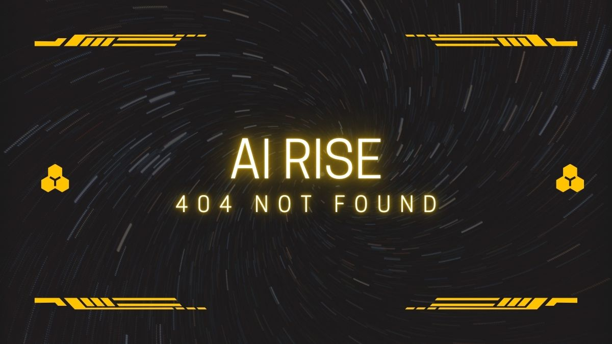
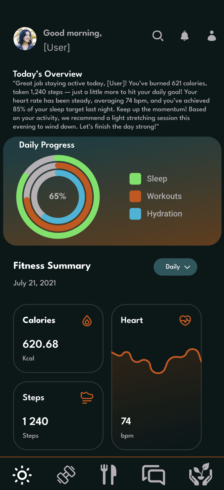
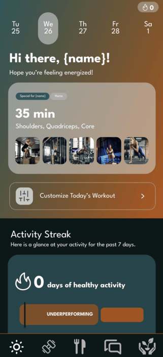
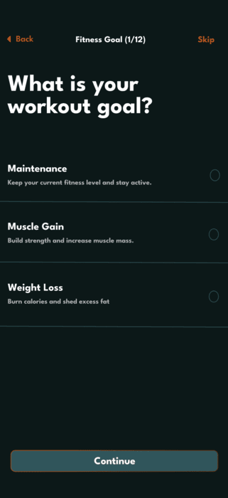
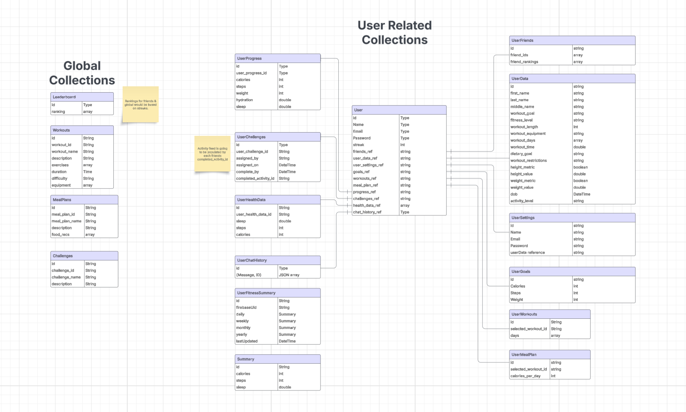

<h1 align="center">🏋️‍♀️ AiRise – The Smart Personal Health Companion</h1>

<p align="center">
  <i>An AI-powered fitness and wellness platform designed to provide personalized coaching, real-time progress tracking, smart nutrition advice, and gamified motivation.</i>
</p>

<p align="center">
  
</p>

---

<h2>📱 Overview</h2>

<p>
AiRise bridges the gap between convenience and results. Built with full-stack flexibility and mobile optimization in mind, it empowers users to take control of their health with personalized routines, meal planning, progress tracking, and smart-device integrations—all driven by AI.
</p>

<h3>✨ Key Features</h3>

<ul>
  <li><b>AI-Powered Coaching:</b> Personalized workouts, meal plans, and goal tracking.</li>
  <li><b>Smart Progress Tracker:</b> Visual analytics and adaptive goal scaling.</li>
  <li><b>Meal Planner & Nutrition Tracker:</b> Daily intake tracking and meal suggestions.</li>
  <li><b>Gamification & Social Engagement:</b> Leaderboards, streaks, and community challenges.</li>
  <li><b>Smart Device Integration:</b> Connect with fitness trackers and health apps.</li>
  <li><b>Push & Email Notifications:</b> Stay on track with timely alerts and weekly summaries.</li>
</ul>

---

<h2>📂 Project Structure</h2>

```
/frontend   # (Kotlin Multiplatform) mobile application
/backend    # RESTful backend API (.NET 9)
```

<p>Each folder contains its own README with setup details and architecture.</p>

---

<h2>🚀 Deployment</h2>

<p>
Deployment for this project is currently manual.
</p>

<ul>
  <li><b>Mobile (Frontend):</b> Built in Android Studio → deployed to APK / Play Store</li>
  <li><b>Backend API:</b> Deployed on Azure or local server for demo</li>
  <li><b>Database:</b> SupaBase & MongoDB Atlas (cloud-hosted)</li>
</ul>

---

<h2>🚀 Getting Started</h2>

<h3>✅ Prerequisites</h3>

<ul>
  <li>.NET 9 SDK</li>
  <li>Android Studio</li>
  <li>Kotlin Multiplatform</li>
</ul>

---

<h3>⚙️ Environment Setup</h3>

```bash
git clone https://github.com/JSDWRLD/AiRise
cd airise
```

<b>Frontend (Mobile App):</b>

```bash
cd frontend
# Open in Android Studio
```

<b>Backend (API):</b>

```bash
cd backend
# Open in Visual Studio
```

---

<h2>📸 Visuals</h2>

Click the dropdown menus to view images!

<details>
  <summary>📱 Core Features</summary>
  <table>
    <tr>
      <td align="center"><b>Homescreen</b><br></td>
      <td align="center"><b>AI Coach Chat</b><br></td>
    </tr>
    <tr>
      <td align="center"><b>Workouts</b><br></td>
      <td></td>
    </tr>
  </table>
</details>

<details>
  <summary>⚙️ Onboarding & Settings</summary>
  <table>
    <tr>
      <td align="center"><b>Onboarding UI</b><br></td>
      <td></td>
    </tr>
  </table>
</details>

---

<h2>🧠 Architecture</h2>

<p align="center">
  
</p>

<p align="center"><i>An overview of the system: mobile frontend ↔ backend services ↔ database</i></p>

---

<h2>🛠️ Technologies</h2>

<table>
  <tr>
    <th>Frontend</th>
    <th>Backend</th>
    <th>AI & ML</th>
    <th>Database</th>
    <th>Integrations</th>
  </tr>
  <tr>
    <td>Kotlin, KMP</td>
    <td>.NET 9, Firebase Auth</td>
    <td>Google Gemini, Image Processor</td>
    <td>MongoDB, SupaBase</td>
    <td>Google Fit, Apple Health, Wearables</td>
  </tr>
</table>

---

<h2>📌 Rules & Guidelines</h2>

<h3>👨‍💻 Developer Instructions</h3>

<ol>
  <li>Clone the repo and check the correct branch.</li>
  <li>Follow README setup instructions inside <code>/frontend</code> and <code>/backend</code>.</li>
  <li>Update your feature branch often with <code>main</code> to avoid conflicts.</li>
  <li>Write clear commits & keep PRs small for fast reviews.</li>
</ol>

<h3>🔀 Branching Strategy</h3>

- Always use feature branches: `git checkout -b feature/my-feature`
- Never push directly to `main`

<h3>✅ Pull Request Protocol</h3>

- At least <b>2 reviewers</b> must approve before merging.
- Ping the team on Discord (`@everyone`) for visibility.
- Keep PRs <b>small, atomic, and focused</b>.

<h3>✍️ Commit Format</h3>

```bash
type: short description
```

> Example: `feat: add AI meal suggestion endpoint`

<h3>🔐 Security</h3>

- Do <b>not</b> commit `.env` files or secrets.
- Use `.gitignore` to protect sensitive data.

---

<h2>🧪 Feature Checklist</h2>

<h3>✅ Core Features</h3>

- [x] AI-powered workout suggestions  
- [x] Nutrition and meal tracking  
- [x] Progress analytics  
- [x] Community and gamification  
- [x] Smart device integration  

<h3>🚧 Stretch Goals</h3>

- [ ] 📷 <b>Computer Vision</b> for form checking  
- [ ] 🥗 Meal image analysis for macronutrient estimation  

---

<h2>🗓️ Project Timeline</h2>

<p>Below is a rough breakdown of our milestones and deadlines, based on our JIRA sprint planning:</p>

<table>
  <tr>
    <th>Milestone</th>
    <th>Due Date</th>
    <th>Status</th>
  </tr>
  <tr>
    <td>✅ SPRINT 0 Project Approval</td>
    <td>Jan 28, 2025</td>
    <td>Completed</td>
  </tr>
  <tr>
    <td>✅ SPRINT 1 UI Prototype</td>
    <td>Feb 17, 2025</td>
    <td>Completed</td>
  </tr>
  <tr>
    <td>✅ SPRINT 2 User Registration and Onboarding</td>
    <td>Mar 03, 2025</td>
    <td>Completed</td>
  </tr>
  <tr>
    <td>✅ SPRINT 3 Homescreen</td>
    <td>Mar 17, 2025</td>
    <td>Completed</td>
  </tr>
  <tr>
    <td>✅ SPRINT 4 User Onboarding Fix and Profile Integration</td>
    <td>Apr 26, 2025</td>
    <td>Completed</td>
  </tr>
  <tr>
    <td>✅ SPRINT 5 Community Engagement</td>
    <td>Aug 27, 2025</td>
    <td>In Progress</td>
  </tr>
  <tr>
    <td>✅  SPRINT 6 Workout Plan & Screen</td>
    <td>Sep 17, 2025</td>
    <td>Upcoming</td>
  </tr>
  <tr>
    <td>✅  SPRINT 7 Meal Plan</td>
    <td>Oct 1, 2025</td>
    <td>Upcoming</td>
  </tr>
  <tr>
    <td>✅ SPRINT 8 Customization & Stretch Goals</td>
    <td>Oct 15, 2025</td>
    <td>Upcoming</td>
  </tr>
  <tr>
    <td>✅ SPRINT 9 Handoff</td>
    <td>Oct 29, 2025</td>
    <td>Upcoming</td>
  </tr>
  <tr>
    <td>🎓 Final Presentation & Demo Day</td>
    <td>Nov 19, 2025</td>
    <td>Upcoming</td>
  </tr>
</table>

---

<h2>🧪 Testing: FOR CSC 191 </h2>

<p>
We use manual and automated testing to ensure application stability and reliability across devices.
</p>

<ul>
  <li><b>Frontend Testing:</b> Manual QA on Android devices + Espresso tests</li>
  <li><b>Backend Testing:</b> xUnit test suite for .NET APIs</li>
  <li><b>Mock Data:</b> Fake users and exercise logs to simulate workflows</li>
</ul>

```bash
# Run backend tests
cd backend
dotnet test

# Run frontend unit tests (if applicable)
cd frontend
./gradlew test
```

---

<h2>🤝 Contributing</h2>

Please read the <a href="CONTRIBUTING.md">CONTRIBUTING.md</a> for guidelines.

---

<h2>🙌 Credits</h2>

Made with ❤️ by <b>404 Not Found</b> at <b>California State University Sacramento</b>.  
Special thanks to our mentors, professors, and testers who supported development.

---

<blockquote>
  <p><i>"The only bad workout is the one that didn’t happen."</i><br>— Random Dude</p>
</blockquote>
