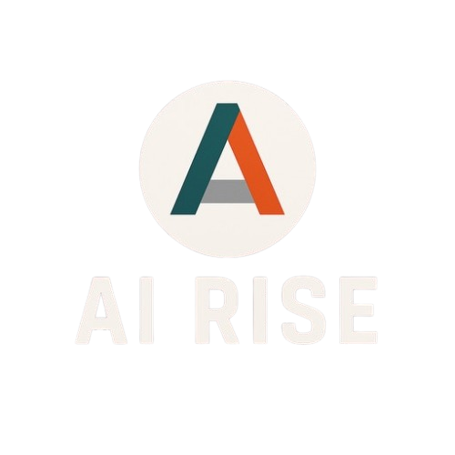

<h1 align="center">🏋️‍♀️ AiRise – The Smart Personal Health Companion</h1>

<p align="center">
  <i>An AI-powered fitness and wellness platform designed to provide personalized coaching, real-time progress tracking, smart nutrition advice, and gamified motivation.</i>
</p>

<p align="center">
  
</p>

---

## 📖 About the Project

**AiRise** bridges the gap between convenience and results. It’s a smart, AI-driven health and fitness app that empowers users to take control of their wellness journey through personalized routines, nutrition plans, and adaptive goal tracking.

### 💡 Why AiRise?

Most people struggle with consistency, motivation, or understanding what works best for their body. AiRise was created to bring personalized fitness and nutrition to everyone, guided by AI insights, backed by data, and enhanced by community support.

---

## ✨ Key Features

- 🤖 **AI-Powered Coaching:** Personalized workouts, meal plans, and fitness insights.  
- 📊 **Smart Progress Tracker:** Visual analytics and adaptive goal scaling.  
- 🍽️ **Meal Planner & Nutrition Tracker:** Daily intake tracking and smart meal suggestions.  
- 🕹️ **Gamification & Community:** Leaderboards, challenges, and social engagement.  
- ⌚ **Smart Device Integration:** Connect with wearables and health platforms like Google Fit or Apple Health.  
- 🔔 **Notifications & Reminders:** Push alerts to keep users on track.  

---

## 📸 Features & Screenshots

Below are visual highlights of AiRise’s core experience. Add or replace screenshots in the `Media/` folder as your project evolves.

### 🏠 Core Experience
| Screen | Description |
|---------|--------------|
|  | **Home Screen** – Displays user stats, goals, and daily summaries. |
|  | **AI Coach Chat** – Personalized fitness and nutrition guidance through chat. |
|  | **Workout Screen** – Suggested routines with AI-driven adjustments. |

### ⚙️ Onboarding & Settings
| Screen | Description |
|---------|--------------|
|  | **Onboarding Flow** – Smooth setup experience for new users. |

---

## 🧠 Architecture Overview

<p align="center">
  
</p>

<p align="center"><i>Architecture showing interaction between mobile frontend, backend API, and databases.</i></p>

---

## 🛠️ Technologies Used

| Frontend | Backend | AI/ML | Database | Integrations |
|-----------|----------|--------|-----------|---------------|
| Kotlin Multiplatform | .NET 9, Firebase Auth | Google Gemini | MongoDB, SupaBase | Google Fit, Apple Health, Wearables |

---

## 📂 Project Structure

```
/frontend   # (Kotlin Multiplatform) mobile application
/backend    # RESTful backend API (.NET 9)
```

Each folder contains its own README with detailed setup and architecture information.

---

## ⚙️ Getting Started

### ✅ Prerequisites
- .NET 9 SDK  
- Android Studio  
- Kotlin Multiplatform  

### 🧩 Installation

```bash
git clone https://github.com/JSDWRLD/AiRise
cd airise
```

#### 📱 Frontend (Mobile App)
```bash
cd frontend
# Open in Android Studio and run on emulator or physical device
```

#### 🖥️ Backend (API)
```bash
cd backend
# Open in Visual Studio and run
```

---

## 🚀 Deployment

- **Mobile:** Build with Android Studio → Deploy APK or publish to Play Store  
- **Backend:** Host on Azure or local server for demo  
- **Database:** SupaBase & MongoDB Atlas (cloud-hosted)

---

## 🧪 Testing

We use both **manual** and **automated testing** to ensure stability across devices.

### 🧩 Frontend Testing
- Manual QA testing on Android devices  
- Automated UI tests using Espresso  

### 🧩 Backend Testing
- xUnit test suite for .NET APIs  
- Mock data for simulated user workflows  

Run tests:
```bash
# Backend tests
cd backend
dotnet test

# Frontend tests
cd frontend
./gradlew test
```

> Test results are stored in `/backend/TestResults` and `/frontend/test-results`.

---

## 🤝 Contributing

Please read the [CONTRIBUTING.md](CONTRIBUTING.md) file before contributing.  
Follow branching and PR guidelines to ensure clean collaboration.

---

## 👥 Team & Credits

**Developed by Team 404 Not Found**  
**California State University, Sacramento – CSC 190 / 191 Capstone Project**

| Name | Role | Contact |
|------|------|----------|
| **John Dong** | Project Lead / Full Stack Developer | [johndong@csus.edu](mailto:johndong@csus.edu) |
| **Nicholas Duong** | Frontend Developer | [nicholasduong@csus.edu](mailto:nicholasduong@csus.edu) |
| **Alec Ferguson** | Frontend Developer | [alecferguson@csus.edu](mailto:alecferguson@csus.edu) |
| **Illya Gordyy** | Frontend Developer | [igordyy@csus.edu](mailto:igordyy@csus.edu) |
| **Octavio Hernandez** | Full Stack Developer | [octaviohernandez2@csus.edu](mailto:octaviohernandez2@csus.edu) |
| **Xiangxin Lin** | Frontend Developer | [xiangxinlin@csus.edu](mailto:xiangxinlin@csus.edu) |
| **Kai McKenzie** | Frontend Developer | [kaimckenzie@csus.edu](mailto:kaimckenzie@csus.edu) |
| **Bahran Temesgen** | Frontend Developer | [bahrantemesgen@csus.edu](mailto:bahrantemesgen@csus.edu) |

**Faculty Mentor:** Dr. Peng Kang & Professor Siddique Maryam

**Course Instructor:** Prof. Kenneth Elliott

---

<p align="center">
  <br>
  <i>"The only bad workout is the one that didn’t happen."</i>
</p>

**© 2025 AiRise | Team 404 Not Found**

---
